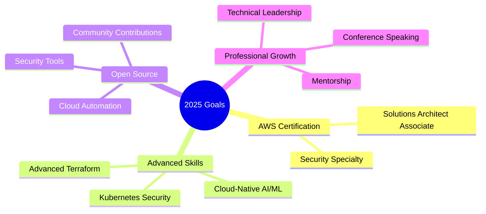

# 👋 Hi, I'm Amr Medhat Amer

<div align="center">

[](https://git.io/typing-svg)

[](https://linkedin.com/in/amrmamer)
[](mailto:amrmedhatamer1@gmail.com)
[](https://github.com/amramer101)


</div>

---

## 🚀 **About Me**

```yaml
name: Amr Medhat Amer
role: Cloud Solutions Architect & DevSecOps Engineer
location: Alexandria, Egypt
education: Computer Science - Cybersecurity (Alexandria University)
gpa: 3.2/4.0 (Top 10%)
languages: [Arabic (Native), English (Professional)]

specializations:
  - Enterprise Cloud Architecture (AWS, Azure, GCP)
  - Infrastructure as Code & Automation
  - Cloud Security & Compliance
  - Cost Optimization & FinOps
  - DevSecOps & CI/CD Pipelines

current_focus:
  - AWS Solutions Architect Certification
  - Advanced Kubernetes & Container Security
  - Cloud-Native AI/ML Solutions
```

---

## 💼 **Professional Experience**

<table>
<tr>
<td width="50%">

### 🌟 **Google Cloud Facilitator**
**Google Cloud Program**  
*Jul 2025 – Present*

✅ **Selected globally** for competitive program  
✅ **100+ hands-on labs** completed  
✅ **25+ Google Cloud badges** earned  
✅ **Top performer** recognition

</td>
<td width="50%">

### 💻 **Cloud Engineer Intern**
**Verizon**  
*Jul 2024 – Aug 2024*

✅ **45% security improvement** via VPN config  
✅ **5 hours/week saved** through automation  
✅ **Python security scripts** implementation

</td>
</tr>
</table>

---

## 🏆 **Impact & Achievements**

<div align="center">

| 🎯 **Metric** | 📈 **Achievement** | 🚀 **Project** |
|:-------------:|:-----------------:|:--------------:|
| **💰 Cost Savings** | **$2,000+/month saved** | FinOps Sentinel |
| **⚡ Performance** | **85% faster scans** | Bravo6 Scanner |
| **📊 Scalability** | **1,000+ concurrent users** | NexusFlow Platform |
| **🔒 Security** | **60% gap reduction** | CloudDrop Platform |
| **🤖 Automation** | **24h → 15min deployments** | Vulnera Toolkit |

</div>

---

## 🛠️ **Technical Arsenal**

<div align="center">

### ☁️ **Cloud Platforms**


### 🔧 **Infrastructure & DevOps**


### 🔐 **Security & Compliance**


### 💻 **Programming & Scripting**


</div>

---

## 🌟 **Featured Projects**

<details>
<summary><b>🛡️ Bravo6 - Enterprise Security Scanner</b></summary>

### **Production-grade serverless security reconnaissance platform**

**🎯 Business Impact:**
- **85% faster** security assessments (45s → 5s)
- **98% cost reduction** through serverless architecture
- **1,000+ concurrent scans** with auto-scaling

**⚙️ Technical Stack:**
`AWS Lambda` `Step Functions` `API Gateway` `DynamoDB` `Python` `CloudWatch`

**🏗️ Architecture:**
- Parallel processing with Step Functions
- Event-driven microservices design
- Security-by-design implementation

[🔗 **View Project**](https://github.com/amramer101/Bravo6)

</details>

<details>
<summary><b>💰 FinOps Sentinel - Cloud Cost Governance</b></summary>

### **Automated Azure cost optimization platform**

**🎯 Business Impact:**
- **90% elimination** of idle resource costs
- **$2,000+ monthly savings** identified
- **Real-time governance** with automated alerts

**⚙️ Technical Stack:**
`Azure Functions` `Logic Apps` `Terraform` `Python` `Blob Storage`

**🏗️ Architecture:**
- Automated resource scanning every 6 hours
- Tag enforcement and compliance reporting
- Email notifications to Finance/DevOps teams

[🔗 **View Project**](https://github.com/amramer101/FinOps-Sentinel)

</details>

<details>
<summary><b>🌐 CloudDrop - Secure File Sharing</b></summary>

### **Enterprise-grade encrypted file sharing platform**

**🎯 Business Impact:**
- **60% reduction** in security audit gaps
- **40% faster** infrastructure provisioning
- **End-to-end encryption** with audit logging

**⚙️ Technical Stack:**
`AWS EC2` `S3` `IAM` `CloudWatch` `Terraform` `Flask` `Python`

**🏗️ Architecture:**
- Centralized IAM with least-privilege access
- Encrypted storage and secure data transfer
- Automated backup and compliance monitoring

[🔗 **View Project**](https://github.com/amramer101/CloudDrop)

</details>

<details>
<summary><b>🔍 Vulnera - Cloud-Native Security Toolkit</b></summary>

### **Serverless cybersecurity assessment platform**

**🎯 Business Impact:**
- **40% infrastructure cost** reduction vs VMs
- **24h → 15min** deployment time
- **Zero secret sprawl** with Key Vault integration

**⚙️ Technical Stack:**
`Azure Container Apps` `Front Door` `Container Registry` `GitHub Actions`

**🏗️ Architecture:**
- Containerized security tools
- Automated CI/CD with security testing
- Managed identities for secret management

[🔗 **View Project**](https://github.com/amramer101/Vulnera)

</details>

---

## 🏅 **Certifications & Recognition**

<div align="center">

### 📜 **Active Certifications**

<table>
<tr>
<td align="center" width="33%">
<br>
<b>AZ-104</b><br>
<small>Azure Administrator Associate</small>
</td>
<td align="center" width="33%">
<br>
<b>AZ-900</b><br>
<small>Azure Fundamentals</small>
</td>
<td align="center" width="33%">
<br>
<b>SC-900</b><br>
<small>Security & Compliance</small>
</td>
</tr>
<tr>
<td align="center">
<br>
<b>CC</b><br>
<small>Cybersecurity Professional</small>
</td>
<td align="center">
<br>
<b>AZ-1002</b><br>
<small>Applied Skills</small>
</td>
<td align="center">
<br>
<b>AZ-1003</b><br>
<small>Applied Skills</small>
</td>
</tr>
</table>

### 🎯 **Currently Pursuing**


</div>

### 🏆 **Awards & Recognition**

<div align="center">

| 🏅 **Award** | 🏢 **Organization** | 📅 **Year** | 🎯 **Achievement** |
|:------------:|:------------------:|:-----------:|:-----------------:|
| **🥇 Top 1%** | Huawei Competition | 2024 | **8/650+ teams** |
| **⭐ Top Performer** | Google Cloud Program | 2025 | **25+ badges earned** |
| **🌟 Team Leader** | Huawei North Africa | 2024 | **99.95% uptime delivered** |

</div>

---

## 📊 **GitHub Analytics**

<div align="center">


</div>

<div align="center">

[](https://git.io/streak-stats)

</div>

---

## 🎯 **Current Goals**

<div align="center">



</div>

---

## 📈 **Activity Graph**

<div align="center">

[](https://github.com/ashutosh00710/github-readme-activity-graph)

</div>

---

## 🤝 **Let's Connect**

<div align="center">

### 💬 **Open for opportunities in:**
🏢 **Cloud Architecture** | 🔒 **DevOps** | 💰 **FinOps** | 🤖 **Automation** | 🎓 **Cybersecurity**

<br>

**📧 Email:** [amrmedhatamer1@gmail.com](mailto:amrmedhatamer1@gmail.com) | **📱 Phone:** +20-1050901746 | **🌍 Location:** Alexandria, Egypt

</div>

---

<div align="center">

### ⭐ **"Building the future of cloud infrastructure, one commit at a time"**

**Thanks for visiting! If you find my work valuable, please consider starring my repositories!** 🌟

</div>
