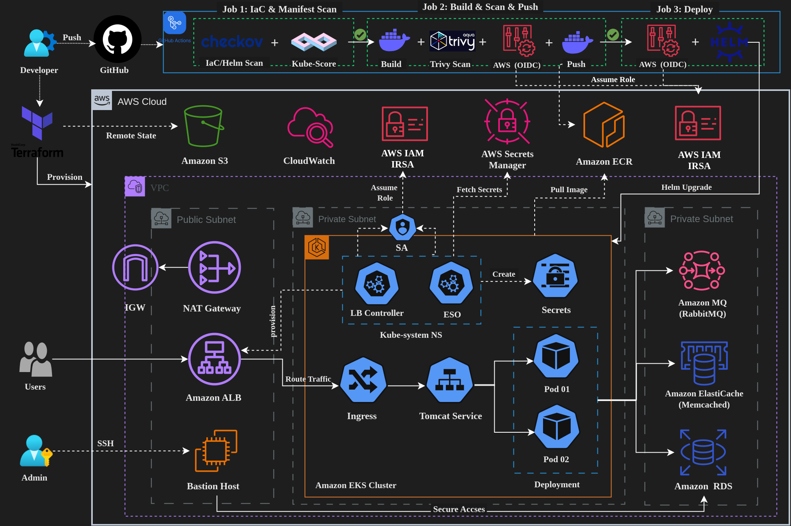
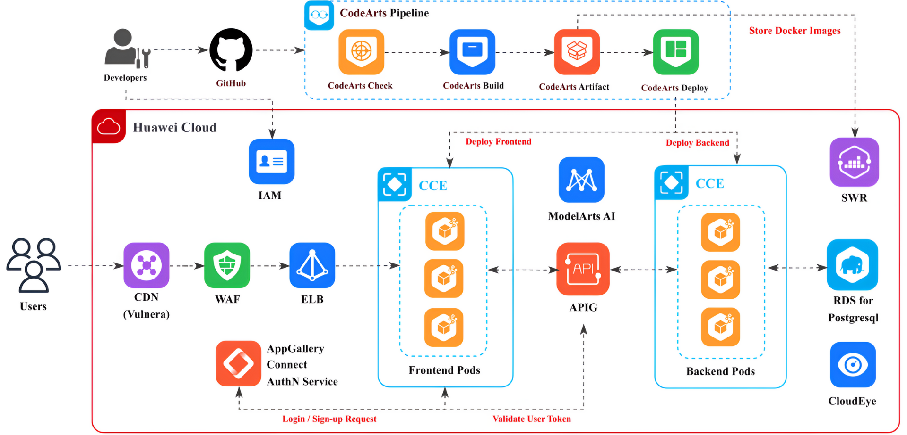
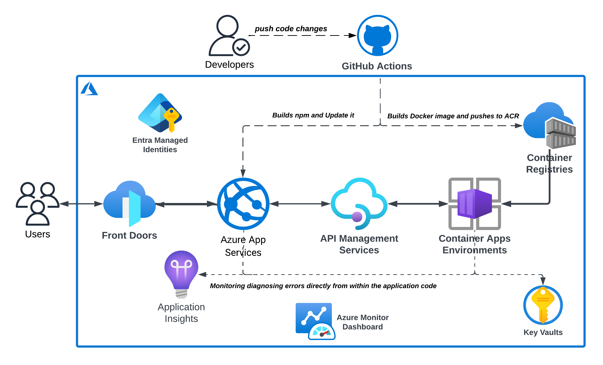
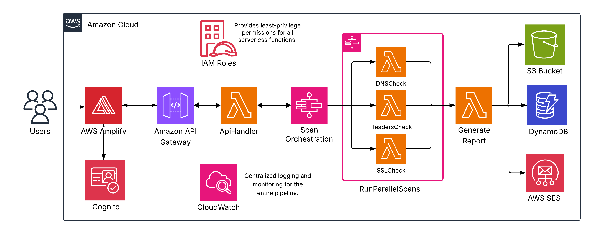
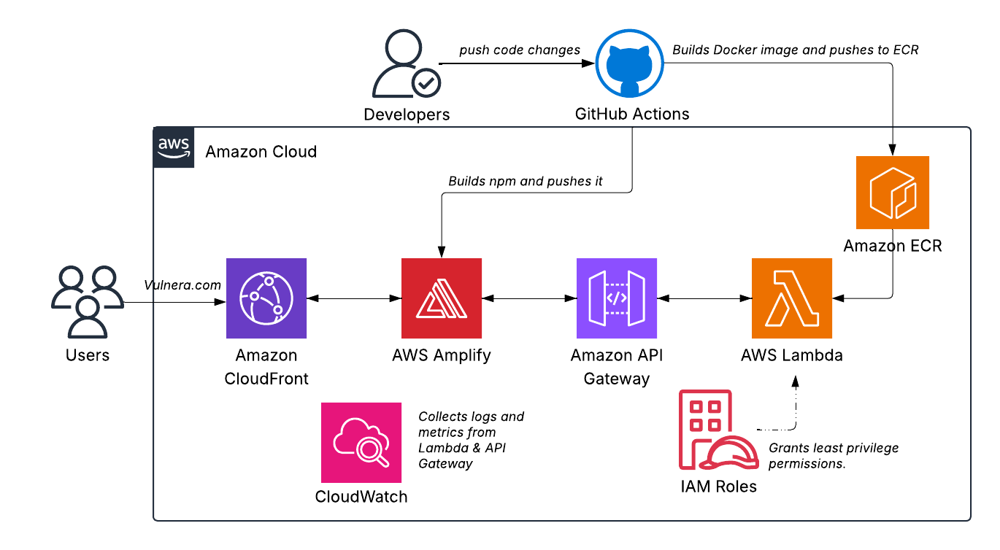
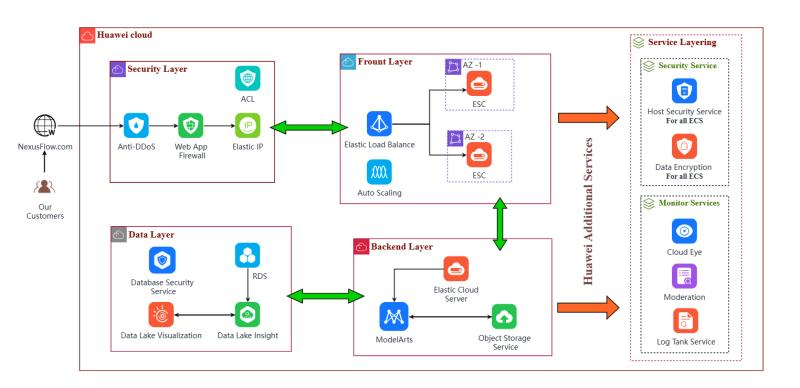

# Amr Medhat Amer

**DevSecOps Engineer · Cloud Infrastructure · Multi-Cloud**

---

I build cloud infrastructure that ships fast, costs less, and is engineered to resist breach at every layer.

Third-year CS student at Alexandria University (Class of 2027) — and I've spent those years building production-grade systems across AWS, Azure, GCP, and Huawei Cloud in environments where cost, security, and uptime actually matter.

In December 2025, my team became the **first Egyptian team in history** to win Huawei Cloud Spark Infinity North Africa — competing against 389 teams and formally recognised by Egypt's Ministry of Higher Education. Two months later, I ranked in the **top 0.1%** of 3,146 students at the Huawei ICT Competition Africa.

> *"A pipeline without security gates isn't CI/CD — it's just fast shipping of problems."*

---

## Recognition

| | |
|---|---|
| 🏆 **1st Place** | Huawei Cloud Spark Infinity 2025, North Africa · 389 teams · First Egyptian team to win |
| 🥉 **Bronze Medal** | Huawei ICT Competition 2025–2026, Cloud Track · Top 0.1% of 3,146 participants nationally |
| 🏅 **Top 5 (1%)** | Huawei Developer Competition 2024, North Africa · 650+ teams |

---

## Projects

### 1. Strata-Ops — 6-Phase Cloud-Native DevSecOps Migration (AWS)

**[→ View on GitHub](https://github.com/amramer101/Strata-Ops)** &nbsp; 

Production-grade migration of a 5-tier Java application — from bare VMs to fully managed AWS cloud-native — with security enforcement at every layer. 300+ Terraform resources across 3 AZs. 3 independent CI/CD pipelines. Every security tool configured as a **hard blocker** — failures abort, never warn.

**Key Results:**

| Metric | Before | After |
|--------|--------|-------|
| Infrastructure cost | $150/mo | $20/mo (87% reduction) |
| Deployment time | 45 min | < 10 min |
| EKS cluster setup | 40 min | 12 min (70% reduction) |
| Hardcoded secrets | Present | Zero — SSM + External Secrets Operator |
| Manual steps | 50+ | 0 |

**Phase Progress:**

| Phase | Focus | Platform | Status |
|-------|-------|----------|--------|
| 1 | Manual → Automated (Vagrant + Bash) | VirtualBox | ✅ Done |
| 2 | AWS Lift & Shift · Jenkins JCasC · SonarQube · Nexus | EC2 + Terraform | ✅ Done |
| 3 | Cloud-Native: RDS · ElastiCache · MQ · Beanstalk | CodePipeline | ✅ Done |
| 4.1 | Containerization + Ansible Automation | Docker Compose + EC2 | ✅ Done |
| 4.2 | ECS Fargate + GitOps + Datadog Full Stack | GitHub Actions | ✅ Done |
| 5 | Amazon EKS + Helm + IRSA + ALB Ingress Controller | EKS | ✅ Done |
| 6 | GitOps (ArgoCD) + Chaos Engineering + FinOps | EKS + ArgoCD | 🔄 Coming Soon |

**Security gates built into every pipeline:**

| Tool | Gate Type |
|------|-----------|
| OWASP Dependency-Check | Hard blocker — `failedTotalCritical: 0` |
| SonarQube / SonarCloud | Hard blocker — quality gate must pass |
| Trivy (FS + Config + Image) | CVE scanning with SARIF → GitHub Security |
| TruffleHog | Secrets scanning — blocks on any finding |
| Checkov + tfsec + Kube-score | IaC misconfig blocking before deployment |
| AWS SSM + External Secrets Operator | Zero plaintext credentials in code or config |

`AWS` `Terraform` `Ansible` `Jenkins JCasC` `GitHub Actions` `CodePipeline` `ECS Fargate` `EKS` `Helm` `ArgoCD` `SonarCloud` `Trivy` `OWASP` `TruffleHog` `Datadog APM` `Prometheus` `Grafana`

---

### 2. Vulnera — Cloud-Native Security Platform · Huawei Cloud 🏆

**[→ View on GitHub](https://github.com/amramer101/Vulnera-Azure)** &nbsp; 

DevSecOps platform on Huawei Cloud for supply chain vulnerability aggregation. Led cloud & DevOps architecture for a 5-person team. Zero-trust traffic architecture: **CDN → WAF → ELB → APIG → CCE**. CodeArts CI/CD for Rust-based microservices. ModelArts AI threat analysis with RDS PostgreSQL persistence.

**Key Results:** 99.9% uptime · 85% faster release cycles · 40% operational cost reduction

`Huawei Cloud` `Kubernetes CCE` `CodeArts CI/CD` `ModelArts AI` `WAF` `RDS PostgreSQL` `Zero-Trust` `Rust` `CloudEye`

---

### 3. FinOps Sentinel — Serverless Cost Governance · Azure

**[→ View on GitHub](https://github.com/amramer101/Azure-FinOps-Sentinel)**

Automated FinOps governance engine that hunts and eliminates cloud waste. Scans every 6 hours for idle VMs, unattached disks, and orphaned IPs. Zero-credential drift via Managed Identity — no service principals. Automated HTML reports delivered via Logic Apps in under 3 minutes.

**Key Results:** $2,000+/mo waste identified · 50+ resources flagged in week one · 8 hrs/mo manual audits eliminated

`Azure Functions` `Logic Apps` `Terraform` `Managed Identity` `Python`

---

### 4. Bravo6 — Serverless Attack Surface Management · AWS

**[→ View on GitHub](https://github.com/amramer101/Bravo6)**

Production-grade, cloud-native security reconnaissance platform for External Security Posture Management. Built entirely on AWS serverless architecture — API Gateway + WAF → Lambda → Step Functions parallel execution → S3 secure report delivery. Zero infrastructure overhead, zero idle costs.

**Key Results:**

| Metric | Traditional | Bravo6 |
|--------|-------------|--------|
| Scan duration | 45–60 sec | 5–8 sec (85% faster) |
| Infrastructure cost | $2,000+/mo | $0–50/mo (98% reduction) |
| Concurrent scans | 1–5 | 1,000+ (200× scalability) |
| Deployment time | 2–4 hours | < 5 minutes |

`AWS Lambda` `Step Functions` `API Gateway` `WAF` `DynamoDB` `S3` `SES` `CloudWatch` `Amplify` `Python`

---

### 5. CloudDrop — Enterprise Serverless File Sharing · AWS

**[→ View on GitHub](https://github.com/amramer101/-CloudDrop)**

Production-ready serverless file-sharing platform on AWS. CloudFront CDN with 400+ edge locations. End-to-end AES-256 + TLS 1.3 encryption. GitHub Actions CI/CD pipeline cutting deployment time from 45 min to 7 min. Zero-downtime blue-green deployments.

**Key Results:** 85% faster deployments · 99.5% uptime · 20% latency reduction

`AWS Lambda` `API Gateway` `S3` `CloudFront` `Amplify` `GitHub Actions` `Docker`

---

### 6. NexusFlow — AI-Powered Supply Chain Platform · Huawei Cloud

AI-driven supply chain platform on Huawei Cloud. Real-time data ingestion via API Gateway, AI forecasting via ModelArts reducing stockouts and overstock by 25%, end-to-end OBS encryption, RBAC controls, and dynamic autoscaling supporting 1,000+ concurrent users.

**Key Results:** 99.95% availability · 25% stockout reduction · 20% cost reduction · 1,000+ concurrent users

`Huawei Cloud` `ECS` `ModelArts` `API Gateway` `WAF` `RDS` `OBS` `Python` `Docker` `CI/CD`

---

## Tech Stack

**Cloud:** AWS · Azure · GCP · Huawei Cloud

**IaC & Automation:** Terraform · Ansible · Helm · ArgoCD · Bash · Python

**CI/CD & DevSecOps:** Jenkins JCasC · GitHub Actions · AWS CodePipeline · GitLab CI · SonarQube · SonarCloud · OWASP · Trivy · TruffleHog · Checkov · tfsec · Kube-score · SARIF · GitHub Advanced Security

**Containers & Orchestration:** Docker · Docker Compose · Kubernetes (EKS / AKS / CCE) · ECS Fargate · Helm

**Observability:** Datadog APM · Prometheus · Grafana · CloudWatch · Firelens (Fluent Bit)

**Managed Services:** RDS · ElastiCache · Amazon MQ · Elastic Beanstalk · AWS Lambda · Azure Functions

---

## Certifications

| | Certification | Issuer | Year |
|---|---|---|---|
| ☁️ | AWS Certified Solutions Architect – Associate (SAA-C03) | Amazon Web Services | 2026 |
| 🔵 | Azure Administrator Associate (AZ-104) | Microsoft | 2025 |
| 🔒 | Security, Compliance, and Identity Fundamentals (SC-900) | Microsoft | 2025 |
| 🛡️ | Junior Cybersecurity Analyst – CyberOps | Cisco | 2024 |
| 🔐 | Certified in Cybersecurity (CC) | ISC2 | 2024 |

---

## Contact

📍 Alexandria, Egypt &nbsp;·&nbsp; Open to **Summer 2026 internships** in DevSecOps · Cloud Engineering · Platform Engineering &nbsp;·&nbsp; Available: Cairo · Alexandria · Remote · EU on-site (Learning Agreement)
